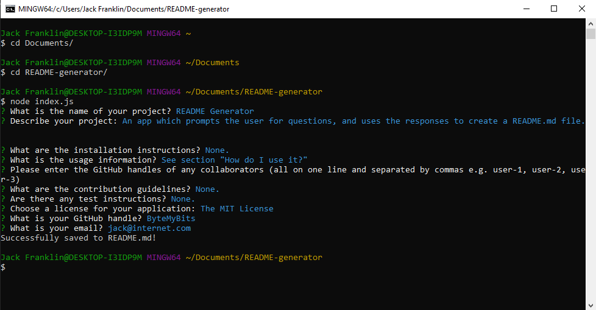

# **README Generator**

Everyone loves a good README, right? It's where bleary-eyed, weary users will turn to at 3am seeking guidance when something inevitably goes wrong with your code (or, y'know, if they just want to learn more about your project). As such, they are important files and you should include one with every project you publish.

Writing them, however, can be tedious. Here I present a very simple command line app which will prompt you for information about your project and churn out a lovely README. Very handy indeed. 

This will give you consistent READMEs across all your repos and make sure you never forget to include something important. 

## The process

I created a template README first, outlining all the important sections, and then stored this as a template literal in my script. From there I was able to write some questions on which to prompt the user. I used the npm module Inquirer, which is able to ask questions and store the responses via the command line. These responses are inserted into the template literal using the interpolation feature, and then saved to a file called README.md.

## How do I use it?

To run this app you need [node](https://nodejs.org/en/) and [npm](https://www.npmjs.com/) to be installed on your computer. 

Save the **index.js** and **package.json** files from this repository in a folder. Use the command line (such as Windows Powershell or Git Bash) to CD into the folder containing these files and run the commands _npm install_ followed by _node index.js_.

